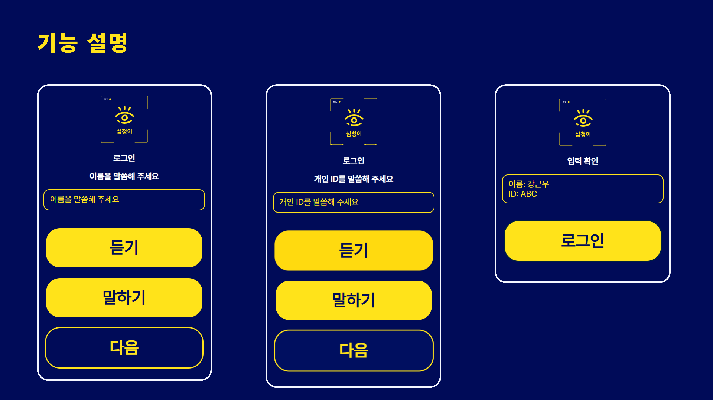
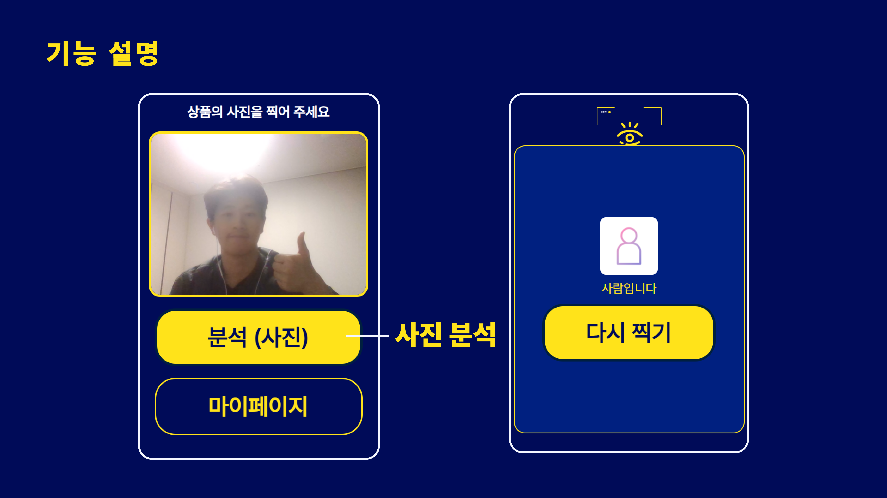
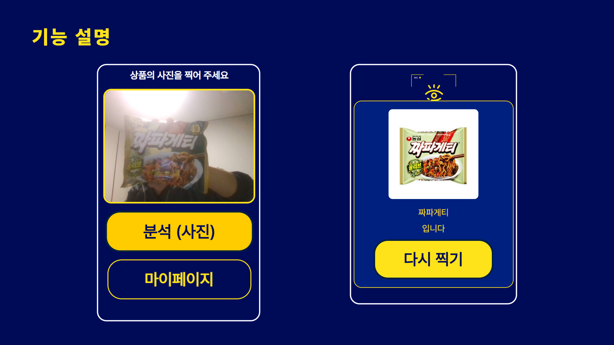
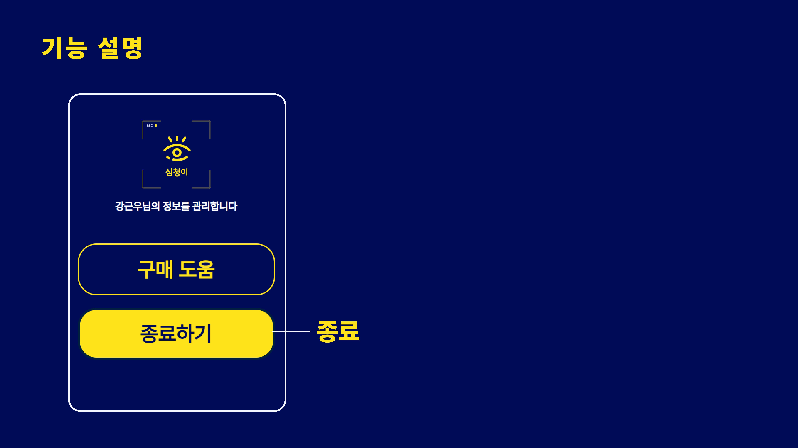

# 🔎 심청이 <br>**2024-02-CSC4004-2-4-Bullsazoo**<br>


## 💻 팀원 소개
### **Back End**
|  |   | 
| :--------------------------------: | :-----------------------------------: | :---------------------------------------: |
| **신재용**                          | **김경섭**                             | **이건민** |
| *🤴 Lead & ⚙️ Backend*             | *⚙️ Backend*                           | *⚙️ Backend*        

<br><br>
### **Front End**
|   | 
| :-----------------------------------: | :-----------------------------------: |
| **강근우**                            | **김민성**
| *💻 Frontend*  & *🎨 Design*                       | *💻 Frontend* |

<br><br>
## **프로젝트 소개**
**심청이** 
**시각 장애인들을 위한 쇼핑 보조 도우미**
- 📸카메라를 통해 상품을 분석하여 상품의 정보를 안내합니다.
- 🌟크고 직관적인 UI
- 📢시각장애인을 위한 음성안내
  <br><br>


## 💡**주요 기능**
- AI와 카메라를 통한 객체 분석
- 상품에 대한 구체적인 정보 제공
- 음성 입력/ 안내 기능 제공
<br><br>

## **시연**
<p align="center">
  
  <br><br>
  
  <br><br>
    
  <br><br>
</p>

## **기술 스택**
<strong> Front END <br></strong>
<br>

 


</p>

<strong> Back END <br></strong>
<br>
 
 
 


<strong> Tool <br></strong>
<br>

 
  
 
 
</p>


## **파일 구조**
### *Front END*
```
src //React 애플리케이션의 메인 폴더로, 프로젝트의 모든 소스 코드가 포함됩니다
 ┣ apis //API 통신 관련 코드가 포함된 폴더입니다
 ┣ assets //프로젝트에서 사용하는 정적 자원을 저장하는 폴더입니다
 ┃ ┣ font //프로젝트에 사용되는 폰트를 저장합니다
 ┃ ┣ images //이미지 파일을 svg 형식으로 사용합니다
 ┣ components //UI 컴포넌트를 저장하는 폴더로, 재사용 가능한 화면 구성 요소를 포함합니다
 ┃ ┣ Camera //물체 인식 기능 관련 컴포넌트
 ┃ ┣ LandingPage //랜딩 페이지 관련 컴포넌트
 ┃ ┣ Login //로그인 페이지 관련 컴포넌트
 ┃ ┣ MyPage //마이 페이지 관련 컴포넌트
 ┃ ┗ Signup //회원가입 페이지 관련 컴포넌트
 ┣ hooks // React의 커스텀 훅(Custom Hook)을 저장합니다
 ┣ pages //각 화면(페이지)별로 구성된 컴포넌트가 포함된 폴더입니다
 ┣ styles //글로벌 스타일 또는 테마 설정 파일이 포함됩니다
 ┣ App.jsx //루트 컴포넌트 (전역 상태, 라우팅 설정, 전체 레이아웃)
 ┣ main.jsx //ReactDOM을 사용해 App.jsx를 HTML에 렌더링
 ┗ router.jsx //React Router를 활용한 라우팅 설정 파일
```

## 📝 **가이드 라인**

### **Back End**

물체인식 및 로그인 & 회원가입 테스트 가이드라인 (POSTMAN)
**실행 순서**
1. git clone URL
2. python -m venv .venv(가상환경설정)
3. source .venv/Scripts/activate(가상환경 활성화)
4. cd backend
5. pip install -r requirements.txt(필수 라이브러리 설치)
6. python manage.py runserver
7. postman 설치 (https://www.postman.com/downloads/)
---------------------------------------------------------
## 로그인 & 회원가입 테스트
```
POSTMAN 실행
method  POST

회원가입(url) : http://127.0.0.1:8000/user/signup/

로그인(url) : http://127.0.0.1:8000/user/login/

Headers : 
Key : Content-Type
Value : application/json

Body :
raw + JSON

아래 형식으로 저장
{
    "personal_id": "신재용",
    "password": "잘생겼어"
}
SEND 버튼 클릭 및 결과
{
		"알림": "회원가입이 완료되었습니다. 이름 : 신재용, 개인ID : 잘생겼어"
}
```
로그인도 과정은 똑같습니다.<br><br>
---------------------------------------------------------

물체인식 테스트
```
backend/media/uploads 경로에 이미지 저장

POSTMAN 실행
method : post
urls: http://127.0.0.1:8000/analyze/detect/

Headers 
Key : Content-type
Value : application/json

Body 
raw + JSON
아래 형식으로 저장
{
    "image_name : test.jpt",(저장한 이미지 파일 이름)
    "user_id": "1" (사용자의 고유 id (default = 1))
}


결과 예시
{
    "status": "success",
    "message": "Image processed and objects saved successfully.",
    "detected_objects": [
        "스프라이트"
    ],
    "processed_image_path": "C:\\Users\\Administrator\\Desktop\\newssss\\2024-02-CSC4004-2-4-Bullsazoo\\backend\\media\\uploads\\please.jpg"
}
```
여기서 processed_image_path는 로컬 환경의 경로<br><br>
---------------------------------------------------------
### **Front end**
**실행 순서**
1. git clone URL
2. cd frontend
3. cd ossp_neverdie_fe 
4. npm i
5. npm run dev
