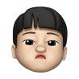

# 🔎 **심청이**  
### *2024-02-CSC4004-2-4-Bullsazoo*  

## 💻 팀원 소개
### **Back End**
|  |   | 
| :--------------------------------: | :-----------------------------------: | :---------------------------------------: 
| **신재용**                          | **김경섭**                             | **이건민** |
| *🤴 Lead & ⚙️ Backend*             | *⚙️ Backend*                           | *⚙️ Backend*        

  
### **Front End**
|   | 
| :-----------------------------------: | :-----------------------------------: |
| **강근우**                            | **김민성**
| *💻 Frontend*                         | *💻 Frontend* |

  
## **프로젝트 소개**
**심청이** 
**시각 장애인들을 위한 쇼핑 보조 도우미**
- 📸카메라를 통해 상품을 분석하여 상품의 정보를 안내합니다.
- 🌟크고 직관적인 UI
- 📢시각장애인을 위한 음성안내

  
## **기술 스택 **

## **파일 구조**

## **심청이 기능**

## **가이드 라인**

### **Back End**

  
### **Front end**
***실행 순서***

1. git clone URL
2. cd frontend
3. cd ossp_neverdie_fe 
4. npm i
5. npm run dev

--
## **시연 영상**

--
